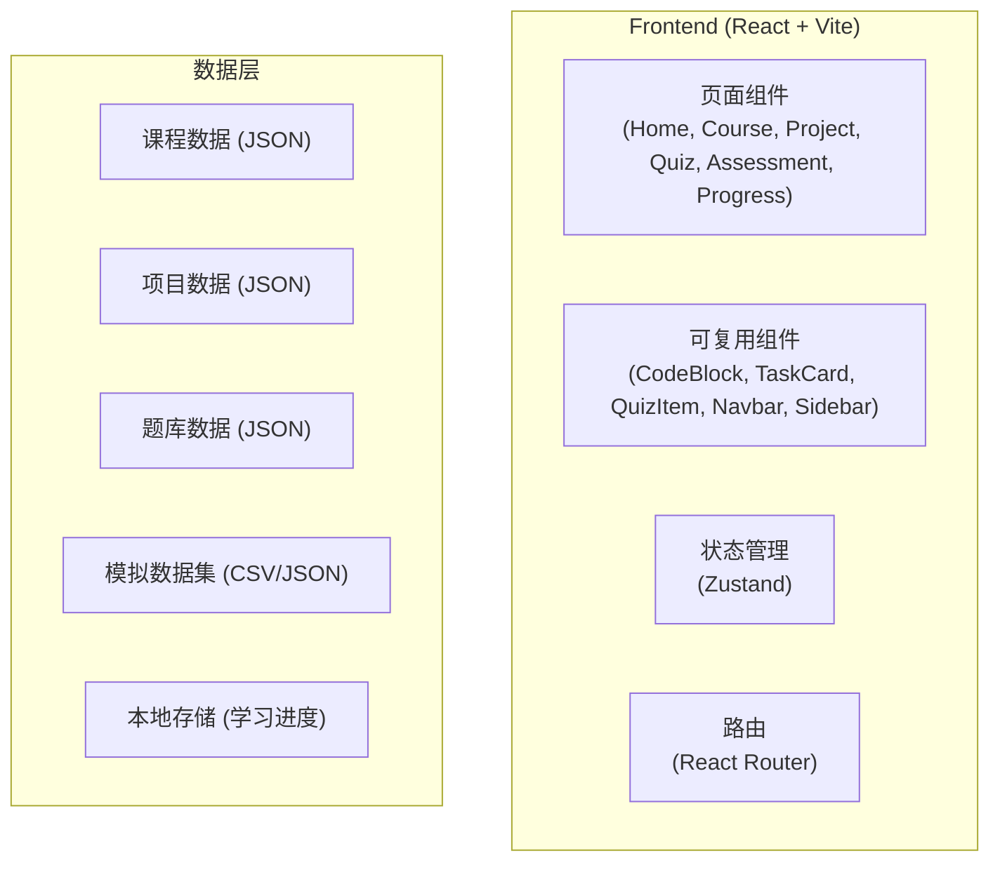

# Pandas 数据分析训练营 - 技术架构文档

## 1. Architecture Design



## 2. Technology Description
- **Frontend**: React@18 + TypeScript + Tailwind CSS@3 + Vite
- **初始化工具**: vite-init
- **后端**: 纯前端项目，使用本地存储管理进度
- **数据存储**: 内置 JSON 数据文件 + LocalStorage
- **代码高亮**: react-syntax-highlighter
- **图标**: lucide-react
- **状态管理**: zustand

## 3. Route Definitions

| Route | Purpose |
|-------|---------|
| / | 首页/课程概览 |
| /course/:chapterId | 课程章节学习 |
| /project/:projectId | 项目任务 |
| /quiz/:chapterId | 练习题库 |
| /assessment/:type | 测评考核 |
| /progress | 学习进度 |

## 4. API Definitions
本项目为纯前端项目，无后端 API，所有数据通过内置 JSON 文件加载。

## 5. Server Architecture Diagram
不适用，纯前端项目。

## 6. Data Model

### 6.1 课程数据结构

```typescript
interface Chapter {
  id: string;
  title: string;
  order: number;
  learningObjectives: string[];
  prerequisites: string[];
  theory: string;
  codeExamples: CodeExample[];
  businessInsights: string;
  commonMistakes: string[];
  summary: string;
}

interface CodeExample {
  title: string;
  description: string;
  code: string;
  explanation: string;
}
```

### 6.2 项目数据结构

```typescript
interface Project {
  id: string;
  title: string;
  description: string;
  order: number;
  difficulty: 'beginner' | 'intermediate' | 'advanced';
  tasks: {
    basic: Task[];
    advanced: Task[];
    comprehensive: Task[];
  };
  dataset: string;
  businessScenario: string;
}

interface Task {
  id: string;
  title: string;
  description: string;
  steps: string[];
  requirements: string[];
  hint?: string;
  solution?: string;
}
```

### 6.3 题库数据结构

```typescript
interface Quiz {
  id: string;
  chapterId: string;
  questions: Question[];
}

interface Question {
  id: string;
  type: 'single' | 'multiple' | 'code-fix' | 'code-fill' | 'coding';
  difficulty: 'easy' | 'medium' | 'hard';
  question: string;
  options?: string[];
  correctAnswer: string | string[];
  explanation: string;
  knowledgePoint: string;
  codeSnippet?: string;
  solutionCode?: string;
}
```

### 6.4 测评数据结构

```typescript
interface Assessment {
  id: string;
  type: 'section' | 'unit' | 'stage' | 'final';
  title: string;
  description: string;
  duration: number;
  totalScore: number;
  passingScore: number;
  questions: AssessmentQuestion[];
  dimensions: string[];
}

interface AssessmentQuestion {
  id: string;
  dimension: string;
  question: Question;
  score: number;
}
```

### 6.5 学习进度数据结构

```typescript
interface LearningProgress {
  chapters: Record<string, { completed: boolean; lastAccessed: number }>;
  projects: Record<string, { completed: boolean; tasks: Record<string, boolean> }>;
  quizzes: Record<string, { score: number; completed: boolean }>;
  assessments: Record<string, { score: number; passed: boolean; completedDate: number }>;
}
```
